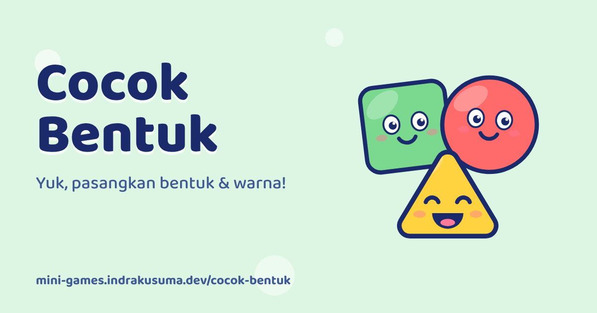

<div align="center">

<a href="https://mini-games.indrakusuma.dev/cocok-bentuk/"></a>

# Cocok Bentuk

**Yuk, pasangkan bentuk &amp; warna!**

[▶️ Main sekarang](https://mini-games.indrakusuma.dev/cocok-bentuk/) · Bagian dari [Taman Bermain](https://mini-games.indrakusuma.dev) · Dibuat oleh [Indra Kusuma](https://indrakusuma.dev)

</div>

## Tentang

Game cocok bentuk dan warna untuk anak. Seret bentuk lucu ke rumahnya sambil belajar nama bentuk dan warna. Gratis, langsung main di browser.

## Cara Main

1. Tekan **Main!**. Bentuk-bentuk lucu menunggu di rak bawah, dan rumahnya (lubang siluet) ada di atas.
2. Seret setiap bentuk ke rumah yang cocok. Kalau pas, bentuknya masuk dengan bunyi *plop*, tersenyum, dan namanya disebut ("Segitiga!"). Kalau belum pas, bentuknya goyang lalu kembali ke rak, tanpa hukuman.
3. Satu ronde ada 3 papan: 3 bentuk, lalu 4 bentuk, lalu papan warna, di mana bentuk dicocokkan ke cipratan cat yang warnanya sama ("Merah!").
4. Selesai tiga papan, anak mendapat 1 bintang. Bintang tersimpan di perangkat.

Di awal papan, bayangan tangan 👆 memperlihatkan cara menyeret. Petunjuk ini muncul lagi kalau anak diam beberapa saat.

Ada 6 bentuk (lingkaran, kotak, segitiga, bintang, hati, persegi panjang) dan 4 warna (merah, biru, kuning, hijau), dipilih acak di setiap papan. Nama bentuk dan warna diucapkan dengan suara bawaan browser, jadi tidak ada file audio.

## Pengembangan

```bash
npm run dev               # dari root repo, lalu buka /cocok-bentuk/
npm run cocok-bentuk:images   # buat ulang thumbnail & ikon
```
