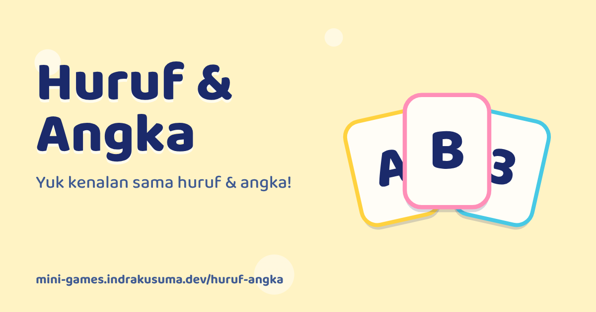

<div align="center">

<a href="https://mini-games.indrakusuma.dev/huruf-angka/"></a>

# Huruf &amp; Angka

**Yuk kenalan sama huruf &amp; angka!**

[▶️ Main sekarang](https://mini-games.indrakusuma.dev/huruf-angka/) · Bagian dari [Taman Bermain](https://mini-games.indrakusuma.dev) · Dibuat oleh [Indra Kusuma](https://indrakusuma.dev)

</div>

## Tentang

Flash card huruf dan angka untuk balita. Ronde singkat, tampilan tenang, tanpa timer, cocok untuk anak yang mudah terdistraksi. Gratis, langsung main di browser.

## Cara Main

Pilih **Huruf** atau **Angka**, lalu pilih mode. Satu sesi berisi 5 kartu tanpa batas waktu, dan setiap sesi yang selesai memberi 1 bintang. Urutan yang disarankan: Kenalan → Tebak → Urutkan.

### 👀 Kenalan
1. Satu kartu besar tampil lengkap dengan gambarnya, lalu dibacakan ("A. Apel!").
2. Ketuk ▶ atau geser kartu untuk lanjut, ◀ untuk mundur. Ketuk kartu untuk mendengar lagi.
3. Setiap sesi berisi 5 kartu berurutan. Sesi berikutnya melanjutkan dari kartu terakhir (A–E, lalu F–J, dan seterusnya). Sesi terakhir huruf berisi U–Z (6 kartu) supaya tidak ada huruf yang diulang, lalu kembali ke A.

### 🎯 Tebak
1. Dengarkan soalnya, misalnya "Mana huruf be?". Tombol 🔊 mengulang suara.
2. Ketuk kartu yang benar.
3. Kalau benar, gambar pendamping muncul ("B, Bola!" ⚽, atau tiga ⭐ untuk angka 3).

### 🧩 Urutkan
1. Beberapa kartu berurutan muncul teracak.
2. Ketuk dari yang pertama (atau angka terkecil). Kartu pindah ke baris jawaban dan namanya dibacakan.

## Dirancang untuk balita

- **Tenang saat soal, meriah saat benar.** Latar polos tanpa animasi saat menebak, lalu konfeti dan suara saat jawaban benar.
- **Salah tidak dihukum.** Kartu bergoyang dan ada ajakan "coba lagi ya". Setelah 2 kali salah, kartu yang benar berkilau sebagai petunjuk.
- **Kesulitan menyesuaikan sendiri.** Mulai dari 2 pilihan (tebak) dan 3 kartu (urutkan). Naik setelah 2 ronde lancar, turun kalau banyak salah. Maksimal 4 pilihan dan 5 kartu.
- **Ringkas.** 5 soal per ronde, sekitar 1–2 menit.

## Suara

Untuk sementara ucapan memakai text-to-speech bahasa Indonesia dari browser, jadi kualitasnya bergantung pada perangkat. Kalau nanti ada rekaman suara, isi `RECORDINGS` di `public/assets/js/game.js` dengan key yang sama (daftar key-nya ada di komentar di sana). File audio taruh di `public/assets/audio/`.

## Pengembangan

```bash
npm run dev               # dari root repo, lalu buka /huruf-angka/
npm run huruf-angka:images   # buat ulang thumbnail & ikon
```
